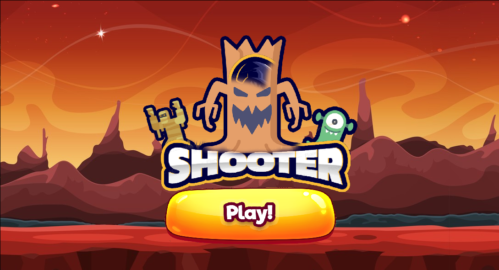
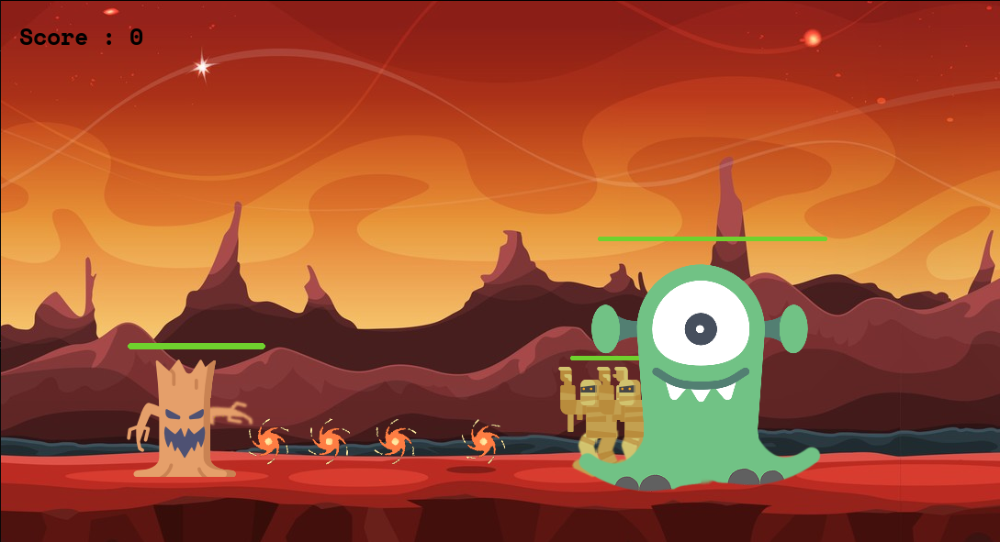

# 🚀 Shooter - Jeu 2D Pygame

**Shooter** est un jeu de tir 2D dynamique développé en Python avec la bibliothèque **Pygame**. Affrontez des vagues d'ennemis monstrueux, évitez les pluies de comètes dévastatrices et tentez d'obtenir le meilleur score possible !

---

## 🎮 Aperçu du Jeu

| Écran d'accueil | En pleine partie |
| :---: | :---: |
|  |  |

---

## 🌟 Fonctionnalités

- **Joueur (Arbre Guerrier) :**
  - Déplacements fluides vers la gauche et la droite.
  - Tir de projectiles pour éliminer les ennemis (Touche `Espace`).
  - *(Remarque : Le joueur ne peut pas sauter).*
- **Ennemis variés :**
  - **Mummies (Mommies)** et **Aliens** qui s'avancent vers le joueur avec leurs barres de vie respectives.
- **Système d'Événement - Pluie de Comètes :**
  - Une jauge se remplit progressivement en bas de l'écran.
  - Une fois la jauge pleine, une **pluie de comètes** s'abat sur le terrain, infligeant des dégâts au joueur s'il ne les esquive pas !
- **Système de Score & Game Over :**
  - Chaque ennemi vaincu augmente votre score.
  - Si la barre de vie du joueur tombe à zéro, la partie se termine (Game Over).

---

## 🕹️ Contrôles

| Action | Touche / Interaction |
| :--- | :--- |
| **Se déplacer à gauche** | `Flèche Gauche` (←) |
| **Se déplacer à droite** | `Flèche Droite` (→) |
| **Tirer / Lancer la partie** | `Bar espace` |
| **Lancer la partie (Clic/Bar espace)** | `Bar espace` / Clic sur le bouton **Play!** |

---

## 📁 Structure du Projet

```text
SHOOTER/
│
├── assets/                          # Ressources du jeu
│   ├── images/                      # Sprites, interfaces et captures
│   │   ├── entities/                # Sprites des personnages et projectiles
│   │   │   ├── comet.png
│   │   │   ├── mummy.png
│   │   │   ├── player.png
│   │   │   └── projectile.png
│   │   ├── screen_shots/            # Captures d'écran pour la documentation
│   │   │   ├── gameplay.png
│   │   │   └── home.png
│   │   └── ui/                      # Éléments d'interface utilisateur
│   │       ├── banner.png
│   │       ├── bg.jpg
│   │       └── button.png
│   └── sounds/                      # Effets sonores et musiques
│
├── src/                             # Code source
│   ├── config/                      # Fichiers de configuration
│   └── core/                        # Logique globale du jeu
│       ├── animations/              # Gestion des animations
│       ├── events/                  # Gestion des événements
│       ├── sprites/                 # Classes des entités du jeu
│       └── main.py                  # Point d'entrée principal
│
├── README.md                        # Documentation du projet
└── .venv/                           # Environnement virtuel Python
```

---

## 🛠️ Prérequis & Installation

### 1. Prérequis
Assurez-vous d'avoir **Python 3.8+** installé sur votre machine.

### 2. Cloner le projet
```bash
git clone https://github.com/votre-utilisateur/shooter.git
cd shooter
```

### 3. Créer un environnement virtuel (recommandé)
```bash
python3 -m venv .venv
source .venv/bin/activate  # Sur Linux/macOS
# .venv\Scripts\activate   # Sur Windows
```

### 4. Installer les dépendances
```bash
pip install pygame
```

---

## 🚀 Lancement du Jeu

Pour démarrer le jeu, exécutez la commande suivante depuis la racine du projet :

```bash
python3 src/core/main.py